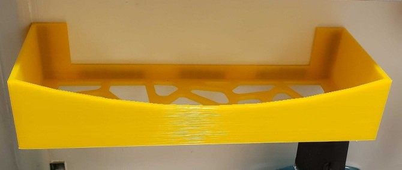

# 3d printed projects

Various models I created for mundane tasks, not deserving of their own repos.

[Various 3D Prints](https://github.com/davidkern/various-3d-prints) by [David Kern](https://github.com/davidkern)
is licensed under [CC BY 4.0](http://creativecommons.org/licenses/by/4.0/?ref=chooser-v1). You are free
to modify and reshare these works for any purpose, as long as you attribute me per the license.

Some models are licensed under different terms - these models are identified in source comments and with a note below.

## Contents

### Bathroom Sink Tray

An above-the-sink shelf for our camper. (GPLv3)

[OpenSCAD](bathroom-sink-tray.scad) / [STL](bathroom-sink-tray.stl)

### GPU Expander (Work in Progress)

[OpenSCAD](gpu-expander.scad).

